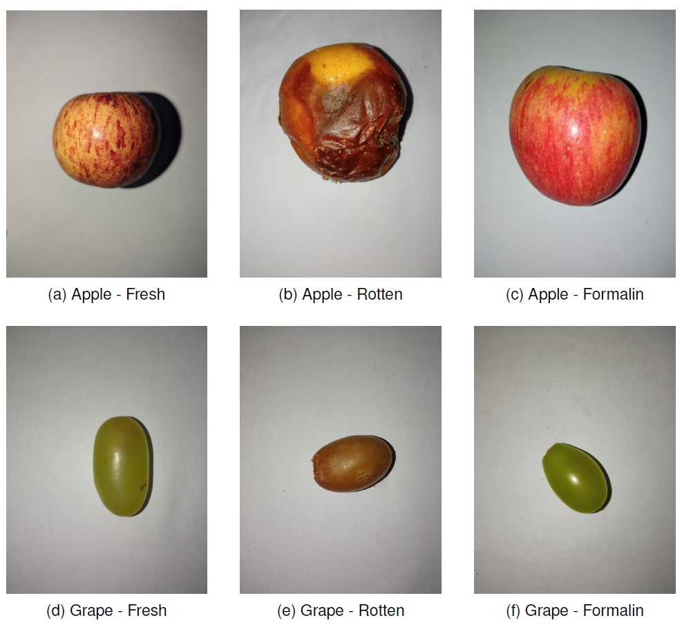

# Trustworthy Deep Learning for Food Quality Control: An XAI-Based Diagnosis of Visual Inspection Models

[]()
[-blue.svg)](https://www.nature.com/srep/)
[](https://opensource.org/licenses/MIT)
[](https://www.python.org/)
[](https://pytorch.org/)

Official code repository and diagnostic evaluation benchmark for the manuscript:  
**"Trustworthy Deep Learning for Food Quality Control: An XAI-Based Diagnosis of Visual Inspection Models"**  
Submitted to *Scientific Reports* (Nature Portfolio).

---

## 📌 Executive Summary

Automated visual quality inspection in post-harvest agricultural supply chains requires not only high classification accuracy but also **verifiable decision logic**. While modern vision architectures achieve near-perfect nominal scores, standard evaluation metrics fail to detect whether a model is learning genuine defect features or exploiting background dataset artifacts.

This repository provides:
1. **Combinatorial Benchmark**: 25 model configurations (5 architectures $\times$ 5 optimization algorithms) trained from scratch under an identical multi-task learning formulation on the FruitVision benchmark.
2. **Explainable AI (XAI) Diagnostic Audit**: High-resolution Grad-CAM and Occlusion Sensitivity workflows used to detect *"right prediction for the wrong reason"* failure modes.
3. **Reproducible Workflows**: Complete, standalone Jupyter notebooks for each of the 25 architecture-optimizer configurations and interpretability diagnostics.



---

## 🔬 Key Findings & Benchmark Summary

* **Top Performer**: Vision Transformer (ViT-B/16) trained with **Stochastic Gradient Descent (SGD) and Momentum** achieved the highest test performance (Quality Macro F1-Score: **0.9973**; Overall Accuracy: **99.73%**).
* **Optimizer Brittleness in Transformers**: Pure Vision Transformers trained from scratch exhibited severe sensitivity to optimizer selection, suffering convergence failure under Lion and Sophia, while SGD provided smooth optimization landscapes.
* **XAI Exposing Shortcut Learning**: The XAI audit revealed that while ViT+SGD learned legitimate epidermal attention, other high-scoring models (such as ViT+Sophia) achieved high nominal accuracy while attending primarily to background wooden bench patterns.

| Architecture | Model Family | Best Optimizer | Quality Macro F1 | Operational Role |
| :--- | :---: | :---: | :---: | :---: |
| **Vision Transformer (ViT-B/16)** | Pure Attention | SGD (Momentum) | **0.9973** | Peak accuracy benchmark |
| **EfficientNet-B3** | Lightweight CNN | Adam / AdamW | 0.9966 | Best for edge deployment (~10.7M params) |
| **Swin Transformer** | Hierarchical ViT | Adam / SGD | 0.9965 | Highly competitive local-global attention |
| **MaxViT** | Hybrid CNN-ViT | Adam / AdamW | 0.9966 | Fast multi-axis attention convergence |
| **ConvNeXt** | Modernized CNN | AdamW | 0.9922 | Collapsed under default SGD ($\text{F1} = 0.4906$) |

---

## 📊 Dataset & Demographics

Experiments were conducted on the **FruitVision dataset**:
* **Total Volume**: Exactly 73,389 RGB images.
* **Fruit Varieties**: Apple (8,461), Banana (16,328), Grape (16,080), Mango (16,072), Orange (16,448).
* **Quality Conditions**: Fresh (30,400), Rotten (20,761), and Formalin-Mixed (22,228).
* **Partitioning**: 60% Training (44,033), 20% Validation (14,678), 20% Testing (14,678) using a fixed random seed (42).
* **Access**: Available publicly on Mendeley Data at [https://data.mendeley.com/datasets/xkbjx8959c/2](https://data.mendeley.com/datasets/xkbjx8959c/2) (Bijoy et al., *Data in Brief*, 2025).

---

## 📁 Repository Structure

```text
trustworthy-food-quality-xai/
├── README.md                              # Comprehensive project documentation
├── requirements.txt                       # Python environment dependencies
├── LICENSE                                # MIT Open Source License
├── .gitignore                             # Ignores large binaries and checkpoints
│
├── 01_sgd_momentum/                       # 5 Models: SGD with Momentum (Top Performer Suite)
│   ├── vit_sgd.ipynb                      # Champion ViT-B/16 (Macro F1 = 0.9973)
│   ├── swin_sgd.ipynb                     # Swin Transformer (Macro F1 = 0.9960)
│   ├── maxvit_sgd.ipynb                   # MaxViT (Macro F1 = 0.9731)
│   ├── convnext_sgd.ipynb                 # ConvNeXt (Collapse F1 = 0.4906)
│   └── efficientnetb3_sgd.ipynb           # EfficientNet-B3 (Macro F1 = 0.9734)
│
├── 02_adam/                               # 5 Models: Standard Adam Optimization
│   ├── vit_adam.ipynb                     # ViT-B/16 (Macro F1 = 0.9816)
│   ├── swin_adam.ipynb                    # Swin Transformer (Macro F1 = 0.9965)
│   ├── maxvit_adam.ipynb                  # MaxViT (Macro F1 = 0.9966)
│   ├── convnext_adam.ipynb                # ConvNeXt (Macro F1 = 0.9812)
│   └── efficientnetb3_adam.ipynb          # EfficientNet-B3 (Macro F1 = 0.9966)
│
├── 03_adamw/                              # 5 Models: AdamW Decoupled Weight Decay
│   ├── vit_adamw.ipynb                    # ViT-B/16 (Macro F1 = 0.8487)
│   ├── swin_adamw.ipynb                   # Swin Transformer (Macro F1 = 0.9838)
│   ├── maxvit_adamw.ipynb                 # MaxViT (Macro F1 = 0.9964)
│   ├── convnext_adamw.ipynb               # ConvNeXt (Macro F1 = 0.9922)
│   └── efficientnetb3_adamw.ipynb         # EfficientNet-B3 (Macro F1 = 0.9952)
│
├── 04_lion/                               # 5 Models: Lion (EvoLved Sign Momentum)
│   ├── vit_lion.ipynb                     # ViT-B/16 (Macro F1 = 0.6902)
│   ├── swin_lion.ipynb                    # Swin Transformer (Macro F1 = 0.6898)
│   ├── maxvit_lion.ipynb                  # MaxViT (Macro F1 = 0.9731)
│   ├── convnext_lion.ipynb                # ConvNeXt (Macro F1 = 0.9906)
│   └── efficientnetb3_lion.ipynb          # EfficientNet-B3 (Macro F1 = 0.9935)
│
├── 05_sophia/                             # 5 Models: Sophia (Second-Order Clipped Stochastic)
│   ├── vit_sophia.ipynb                   # ViT-B/16 (Macro F1 = 0.6636)
│   ├── swin_sophia.ipynb                  # Swin Transformer (Macro F1 = 0.5641)
│   ├── maxvit_sophia.ipynb                # MaxViT (Macro F1 = 0.9602)
│   ├── convnext_sophia.ipynb              # ConvNeXt (Macro F1 = 0.9819)
│   └── efficientnetb3_sophia.ipynb        # EfficientNet-B3 (Macro F1 = 0.9952)
│
├── 06_xai_diagnostics/                    # 2 XAI Diagnostic Workflows
│   ├── gradcam_vit_sgd.ipynb              # High-resolution Grad-CAM spatial heatmaps
│   └── occlusion_sensitivity.ipynb        # Systematic occlusion mapping
│
└── figures/                               # Diagnostic saliency maps and dataset plots
    ├── fig_fruitvision_examples.png
    ├── fig_image_distribution.png
    ├── vitsgd_xai_Apple_Fresh_0001.png
    └── vitsophia_xai_Apple_Fresh_0001.png
```

---

## 🚀 Quick Start

### 1. Installation

Clone this repository and install the required dependencies:

```bash
git clone https://github.com/MissSaumya/trustworthy-food-quality-xai.git
cd trustworthy-food-quality-xai
pip install -r requirements.txt
```

### 2. Dataset Setup
1. Download the FruitVision benchmark from [Mendeley Data](https://data.mendeley.com/datasets/xkbjx8959c/2).
2. Extract the dataset into a local directory:
   ```text
   Dataset/
   ├── Apple/
   ├── Banana/
   ├── Grape/
   ├── Mango/
   └── Orange/
   ```

### 3. Running Training & XAI Diagnostics
Open Jupyter Notebook or JupyterLab:
```bash
jupyter lab
```
* **Top Model Training**: Open `01_sgd_momentum/vit_sgd.ipynb` to inspect or execute the top-performing Vision Transformer pipeline.
* **XAI Diagnostics**: Open `06_xai_diagnostics/gradcam_vit_sgd.ipynb` to generate spatial attribution heatmaps and reproduce diagnostic audits.

---

## 📦 Model Weights & Checkpoints

Pretrained model checkpoint weights (`.pth`) across all 25 architecture-optimizer configurations are openly hosted on Hugging Face due to GitHub file size limits:
* **Hugging Face Repository**: https://huggingface.co/mssaumya/trustworthy-food-quality-xai-weights
* Trained weights can also be requested from the corresponding author.


---

## 📄 Manuscript Status

This research manuscript is currently **under review / submitted** to *Scientific Reports* (Nature Portfolio).

> **Note**: Full publication and citation details (DOI, volume, and article number) will be provided here upon formal acceptance and publication.


---

## 👥 Authors & Contact

* **Saumya** (First Author) – Amrita School of Computing, Amrita Vishwa Vidyapeetham, India
* **Dr. Bagyammal T** (Corresponding Author: `t_bagyammal@cb.amrita.edu`) – Amrita School of Computing, Amrita Vishwa Vidyapeetham, India
* **Karthikeyan Vaiapury** – TCS Research and Innovation, Chennai, India

